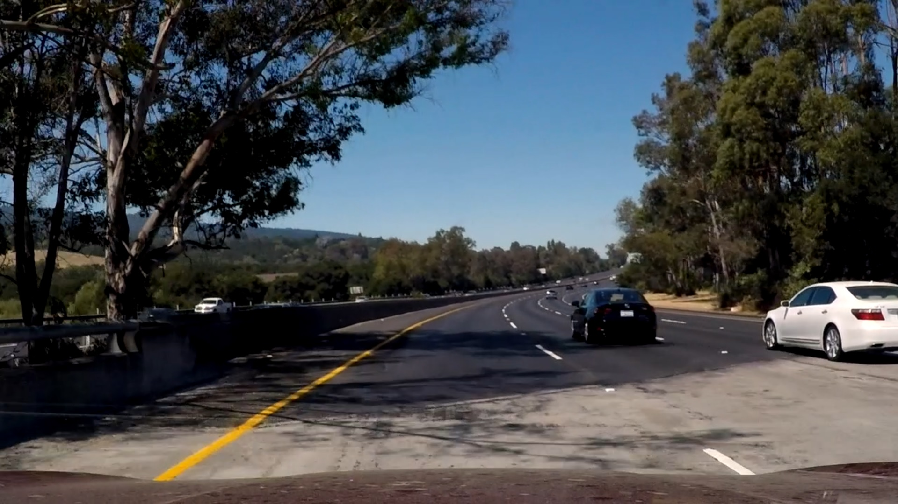
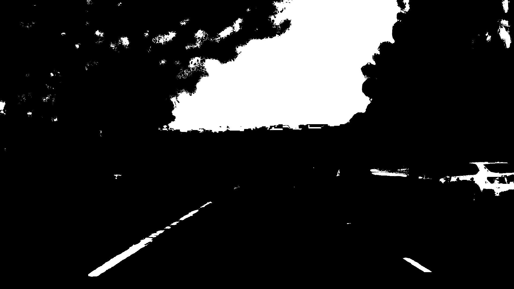
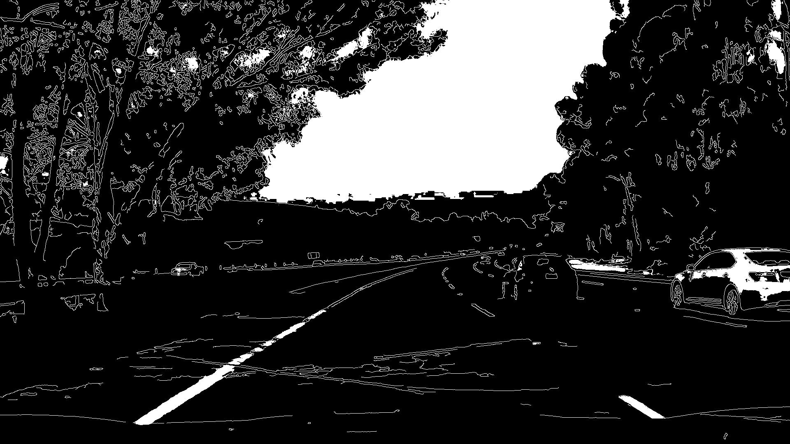
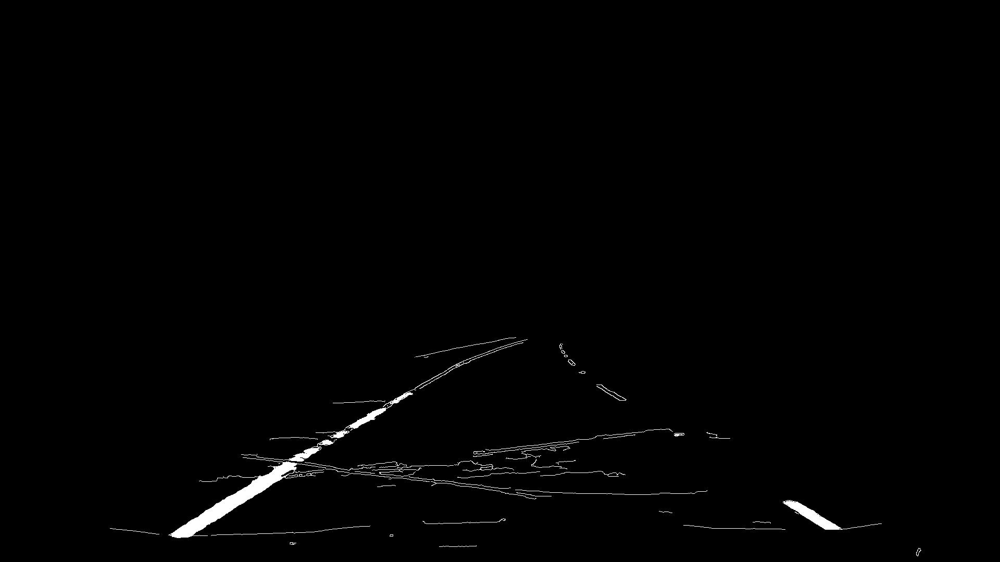
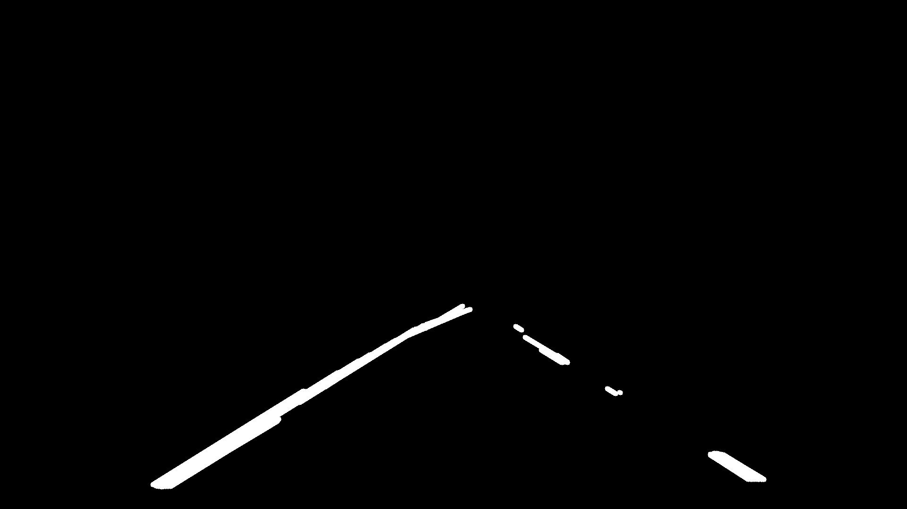
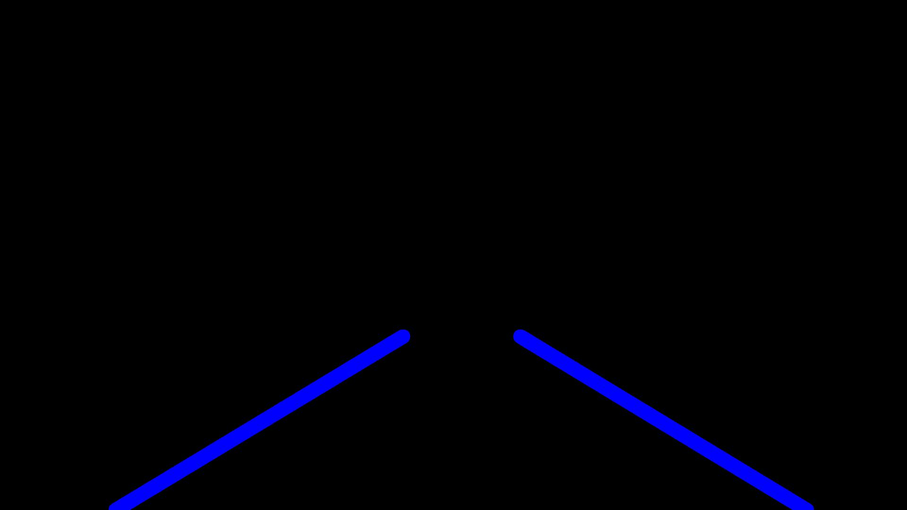
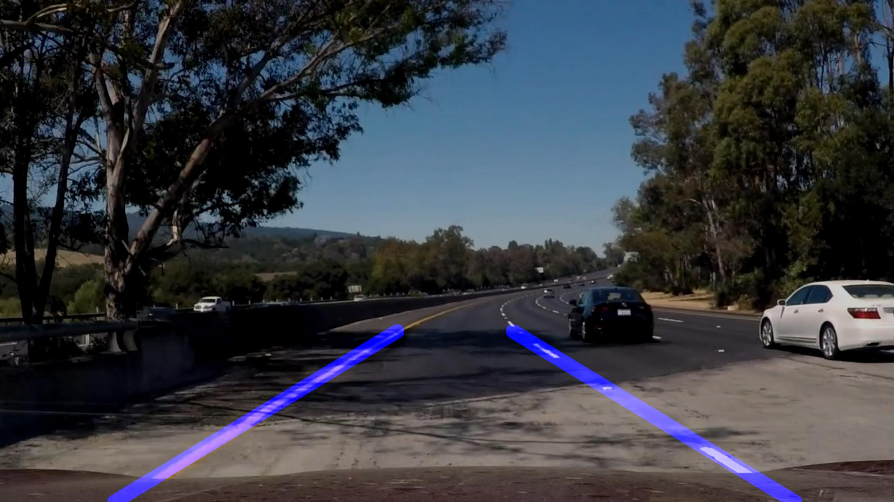

# Lane Lines Detection

---


[](http://www.udacity.com/drive)


## Table of Contents

<!-- TOC -->

- [Description](#description)
	- [Implementation Details](#implementation-details)
- [Usage](#usage)
- [Dependencies](#dependencies)
- [Limitations](#limitations)
- [Possible Improvements](#possible-improvements)

<!-- /TOC -->
---

## Overview

The goal of this project is to detect lane lines in a video stream for different conditions using [Canny Edge Detection](https://en.wikipedia.org/wiki/Canny_edge_detector) and [Hough Line Transform](https://en.wikipedia.org/wiki/Hough_transform).
As a part of Udacity's Self-Driving Cars ND

This repository consists of:


##### [Lanelines_Detection.py](https://github.com/HossamKhalil-hub01/CarND-P1-LaneLinesDetection/blob/master/Lanelines_Detection.py):

The pipeline script written in python, it has the pipeline main function `Lanelines_detection()` that can be used for image or video processing.


##### [test_images](https://github.com/HossamKhalil-hub01/CarND-P1-LaneLinesDetection/tree/master/test_images):

A folder that contains multiple images used for testing.

**Note:** Images that are named callengeX.jpg (where X is a number) have harder conditions such as shadows and hard curvatures, which makes it harder for the detection tasks.


##### [test_vids](https://github.com/HossamKhalil-hub01/CarND-P1-LaneLinesDetection/tree/master/test_vids):

A folder of videos for testing while the [challenge.mp4](https://github.com/HossamKhalil-hub01/CarND-P1-LaneLinesDetection/blob/master/test_vids/challenge.mp4) video is the hardest.

##### [output_images](https://github.com/HossamKhalil-hub01/CarND-P1-LaneLinesDetection/tree/master/output_images):

Contains a folder for each test image and its results in each step of the pipeline.


##### [output_vids](https://github.com/HossamKhalil-hub01/CarND-P1-LaneLinesDetection/tree/master/output_vids):

Contains the results of processing each test video and an illustration for the pipeline  as a video for each important step (color thresholding , edge detection and lines detection).

---
## Description

This simple detection pipeline has several steps any of which can be used individually for other applications:

1. Color thresholding utilizing the S and V channels of HLS color space.
2. Gaussian filtering and canny edge detection.
3. Region masking to extract the region of interest and discard the rest of the image.
4. Lines detection and filtering.
5. Smoothing lane lines over several frames to reduce jittering.
6. Drawing the results on the original image.

### Implementation Details
The following image is used as an illustration, the generated results can be found in [output_images/challenge4](https://github.com/HossamKhalil-hub01/CarND-P1-LaneLinesDetection/tree/master/output_images/challenge4) folder.

**Note**: this image is selected as it contains shadows and curvatures which makes it suitable for exploring each of the pipeline steps.




**1. Color Thresholding**

Color thresholidng is implemented in `laneColors_mask()` function which receives the input image as well as the required thresholds to apply the masking and outputs a masked binary image, which is useful to extract lanelines easliy regardless of the lightness conditions.

*Color Thresholded Image*



**2. Canny Edge Detection**

`canny_edge()` function filters input image first ( assuming grayscale image) then it applies canny edge detection.

The edged detected image is then combined with the color thresholded binary image, in the main pipeline as follows:
```python
#Combine with color masking
binary_edge = np.zeros_like(edge)
binary_edge =cv2.bitwise_or(edge,colorMask)
```
You can see in the result how the color thresholding helped extracting lane lines for the edge detection at the part where the edge detection is not sufficient on its own.

*Edge Detection and Color Thresholding Image*



**3. Region Masking**

After detecting the edges of the image, it is needed to isolate the region of interest (in our case it is the road lane) and discard the rest of the image.
This task is performed by `regionMask()` function that receives the image and the points of the region's corners that are picked in the main pipeline function as follows :
```python
#Shape offsets
width1 = 0.45
width2 = 0.05
region_height = 0.6

#Define the regions four points
pt1 = (int(image.shape[1]/2 - width1*image.shape[1]),int(image.shape[0]))
pt4 = (int(image.shape[1]/2 + width1*image.shape[1]),int(image.shape[0]))
pt2 = (int(image.shape[1]/2 - width2*image.shape[1]) ,int(region_height*image.shape[0]))
pt3 = (int(image.shape[1]/2 + width2*image.shape[1]) ,int(region_height*image.shape[0]))
```
* width1,width2 and region_height can be tuned to achieve the desired result.


*Region Masked Image*



**4.  Lines Detection and Filtering**

after extracting a somewhat clean lane lines edges Hough Line Transform method is then used to detect the lines on the image as follows:

```python
#Hough Lines parameters
rho = 2
theta = np.pi/180
threshold = 70
min_len = 2
max_gap = 50

#Hough lines
houghLines_img = np.zeros_like(regionMasked_img)
lines = cv2.HoughLinesP (regionMasked_img, rho, theta, threshold, minLineLength = min_len, maxLineGap = max_gap)
```

But the region masked image will result in many unwanted lines such as the Horizontal ones, so the unwanted lines are filtered in `filter_horizontal()` function that removes all detected lines that have slopes less than a given slope threshold.


*Hough Lines*


Still our lane lines detection is not good enough as you can see in the previous result, we have multiple redundancies for each lane line (notice that our goal is two lane lines only).
Also, the right lane line has multiple segments not a full line so we need to fix that.

To approach this problem:

* The lines are first sorted into two groups defining each laneline in `sortLines()` function that sorts lines depending on the slope values (notice a lane line has +ve slope while the other has -ve one).

* Then `Lanelines_filtering()` function filters the lines by averaging the lines in the same category by their slopes and intercepts values and returns only two lane lines with the given starting and ending points

The selected points are defined in the following section of the pipeline:
```python   pipeline
#Lanelines filtering
start_y = image.shape[0]
end_y = region_height*(1.1*image.shape[0])
filteredLines = Lanelines_filtering(sortedLines,start_y,end_y)
```


*Filtered Lane Lines*


**5. Smoothing Lane-lines to Reduce Jittering**

This step is only important in the case of a video stream, as computing the lane lines for each frame with small variation from the previous one will result in jittering.

**None**: To have a sense of why this step is important and how a jittering looks like, I used the pipeline on a video stream without using the smoothing step, you can find the result in [solidWhiteRight(Jittery)](https://github.com/HossamKhalil-hub01/CarND-P1-LaneLinesDetection/blob/master/output_vids/solidWhiteRight(Jittery).mp4) video.

For smoothing the lane lines the detected lane lines of previous frames are stored in `prev_leftlines` and `prev_rightlines` lists and for each new frame the detected lane lines are averaged with the last N frames lane lines.
when the number of the stored data exceeds the required (N) frames the oldest item gets removed from the list as follows:

```python
#Remove the oldest readings if the number frames exceeded N
N  = 8


if len(prev_leftlines ) > N :
    prev_leftlines.pop(0)
    prev_rightlines.pop(0)


# Average the last detected lanelines together if previous frames are found
avg_lanelines = Lanelines_filtering([prev_leftlines,prev_rightlines],start_y,end_y)
```

**6. Drawing the results**

``drawLines()`` function draws lines on a given image with a given lines thickness and color which is used to draw the lines of the last image **(Filtered Lane Lines)**.

The last step is to combined this image with the original image to obtain final results as follows:
```python
#Combine lanelines with the original Image
final_img = np.copy(image)
final_img = cv2.addWeighted(image,0.8,filteredLines_img,1,0)
```


*Final Result*


---
## Usage

Use the `Lanelines_detection()` function and input the image or the video frame to be processed, if it is required to use the full pipeline. otherwise you can use any step of the process individually.

At the very last section in [Lanelines_Detection.py](https://github.com/HossamKhalil-hub01/CarND-P1-LaneLinesDetection/blob/master/Lanelines_Detection.py), a demo is included to process an example image from test_images and another to process a video from test_vids .

**Note:** The `Lanelines_detection()` function has a visualization for each step. Feel free to uncomment the visualization section of any stage to visualize and save the results.

---
## Dependencies

* [Python 3](https://www.python.org/downloads/)
* [openCV 3.0](https://opencv.org/opencv-3-0/)
* [matplotlib](https://matplotlib.org/)
* [numpy](https://numpy.org/)
* [moviepy](https://zulko.github.io/moviepy/)

---
## Limitations


- A potential shortcoming could be reveled in the case of extreme curvatures where the lines won't be able to keep up with the lane as it won't be a line any more.

- The region extraction is based on the position of the lane relative to the scene under the assumption that the camera is centered, otherwise this method won't perform as expected.


## Possible Improvements


- A possible improvement would be to consider a lane line as a polynomial of a higher degree not just a simple line and fit a curve that describes each lane line.

- Another potential improvement could be to improve the filtering stages to be more suitable for more challenging cases.
